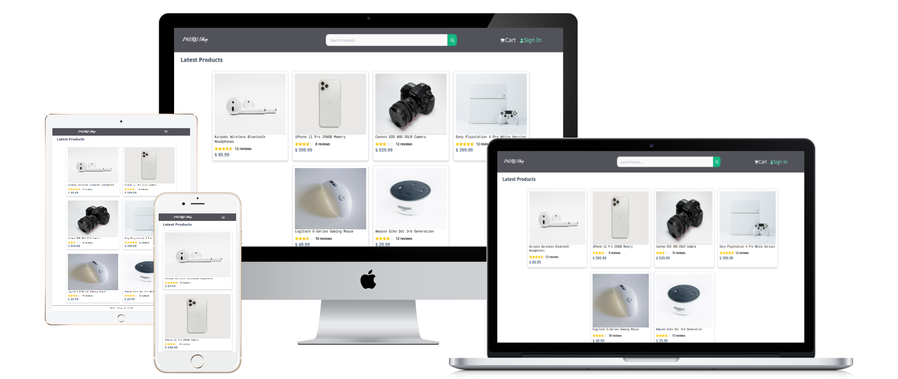
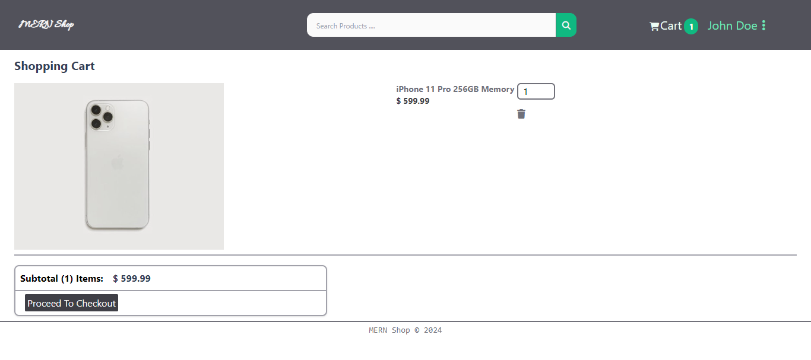
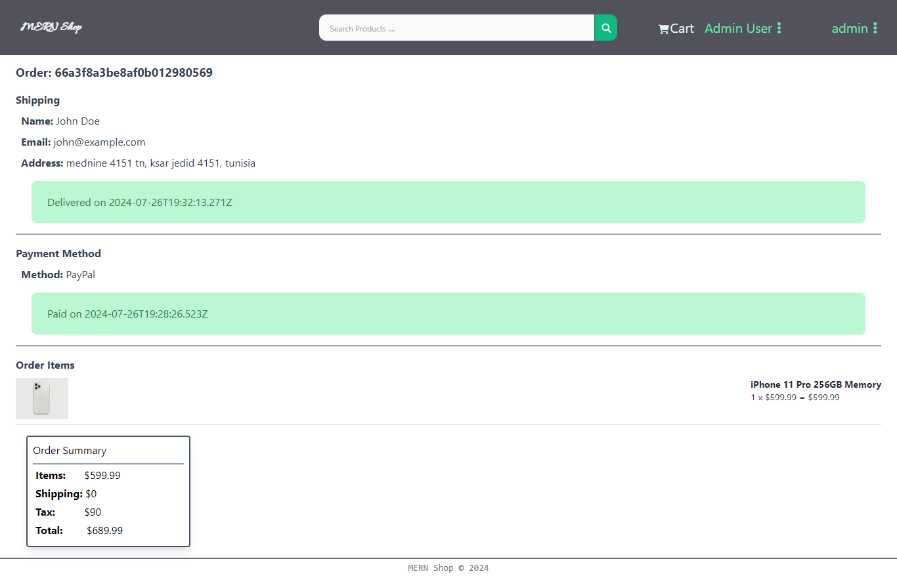
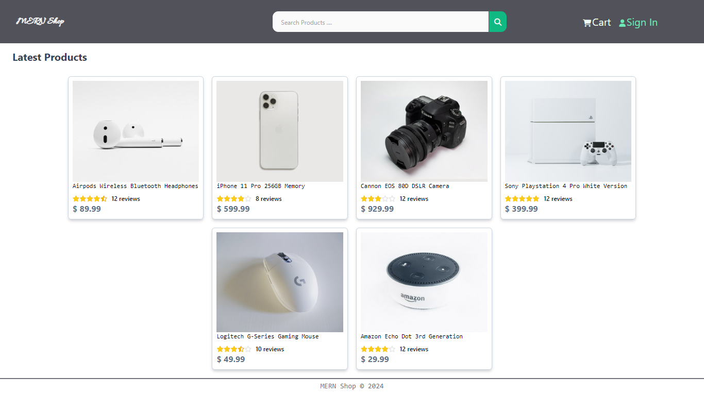
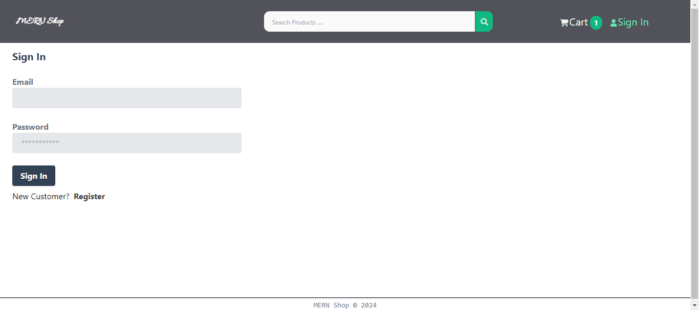
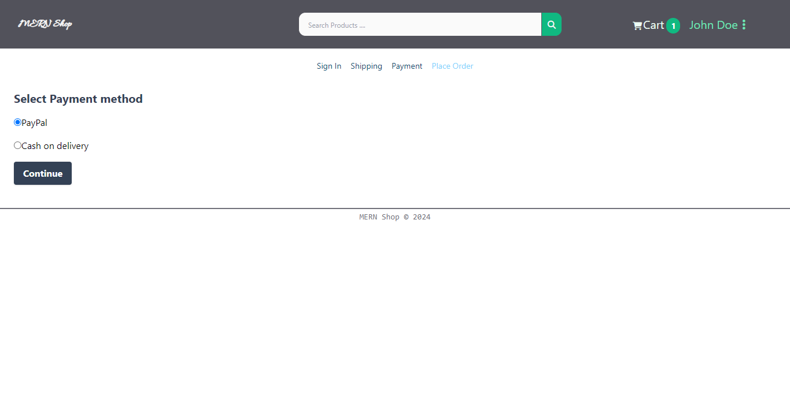
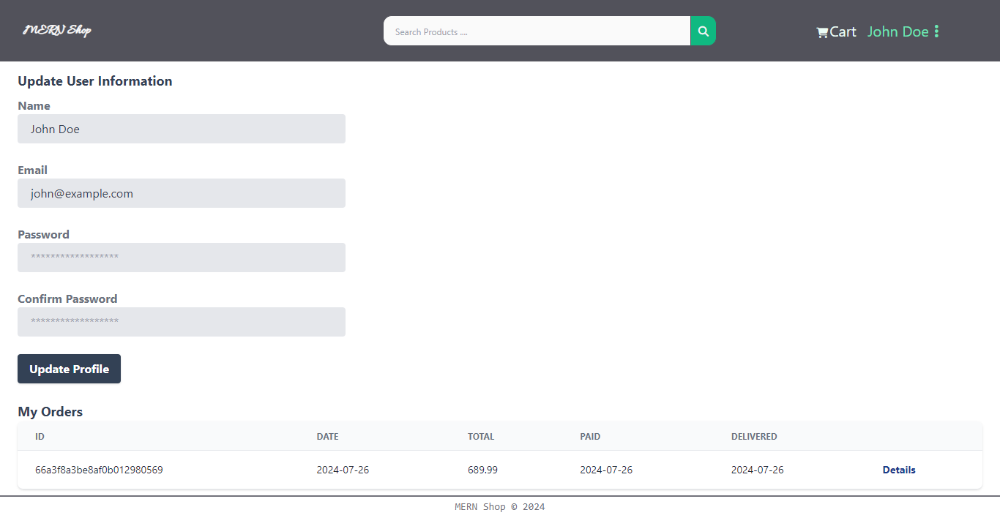
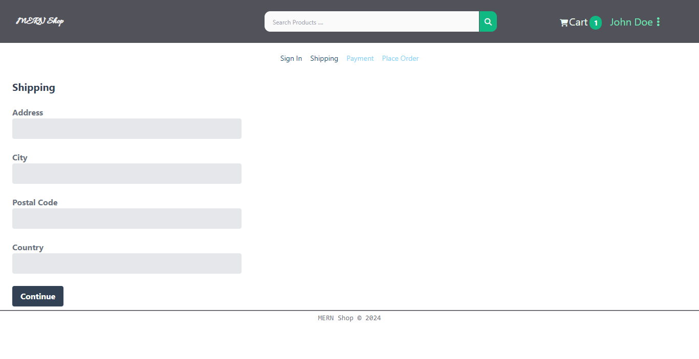

# MERN Ecommerce
### eCommerce platform built with the MERN stack & Redux.

***

## Description:
Build an eCommerce platform from the ground up with React, Redux Toolkit, Express & MongoDB
- Full-featured shopping cart with quantity
- Product reviews and ratings
- Top products carousel
- Product search feature
- User profile with orders
- Admin product management
- Admin user management
- Admin Order details page
- Mark orders as delivered option
- Checkout process (shipping, payment method, etc)
- PayPal / credit card integration
***

## Project Technologies and Features

- React with functional components & hooks
- React router
- React-Bootstrap UI library
- How to structure components
- Component level state & props
- Managing global state with Redux (Actions & Reducers)
- Using Redux state in components (useDispatch & useSelector)
- Creating an extensive back end with Express
- Working with a MongoDB database and the Mongoose ODM
- JWT authentication (JSON web tokens) with HTTP-Only cookie
- Creating custom authentication middleware
- Custom error handler
- Integrating the PayPal API
- Environment variables

## Overview

***

***

***

***

***

***

***

***

***

***

***

***

